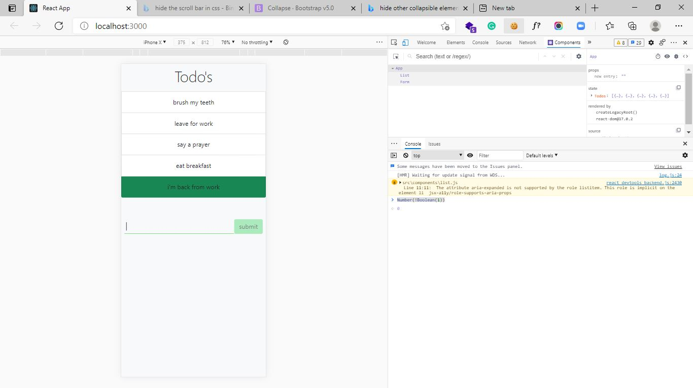

Learnt
How to use REACT CDN to set up
How to create React App using npx

Component,
Component State,
Props,

Project: simple Instagram post template

Note: i used the very little knowledge i have to put this project together as i am still learning,
so it my be cumbersome, i know or hope there will be easier ways of doing this :) 

>feel free to explain or put me in the direction of good react resources

## Day 4
I learnt more on componenets and a huge one (passing in functions as props), with this i can call functions from another componenet, which gives you access to two component states, i thinks its cool

The net ninja (my tutor) put all this in action by building a simple Todo app that could add and delete items, i went a step futher to solidify my knowledge by building a Todo app that could 

>Delete Tasks

> Add Tasks

>Mark task as completed or uncompleted by giving it a different colour and by rearranging the list to make finished task be at the bottom of the list, the code i wrote to make this happen is simple and clean. I am proud

 
